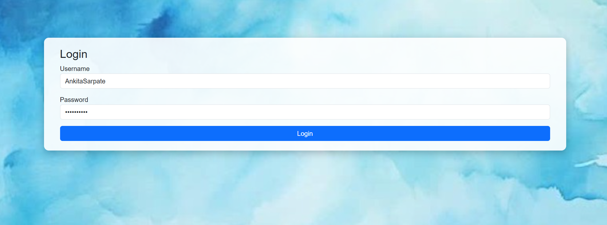
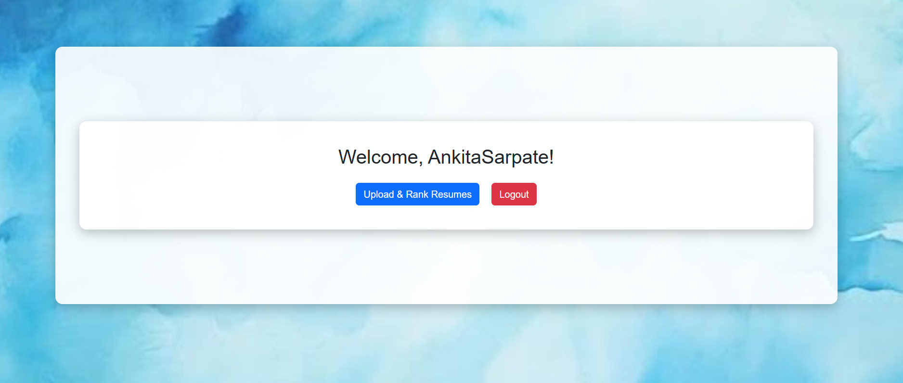
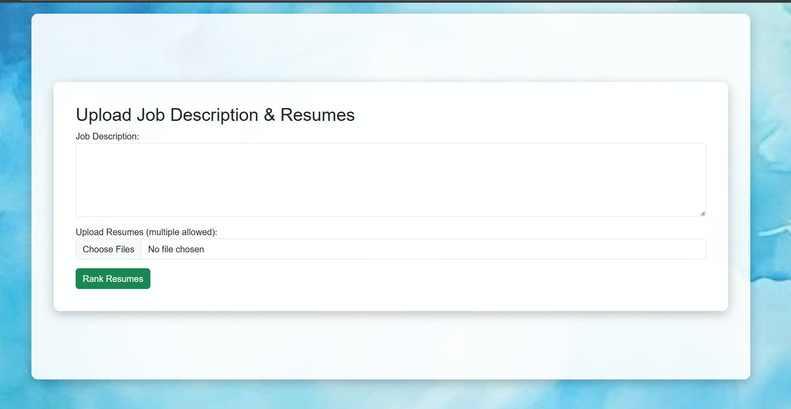
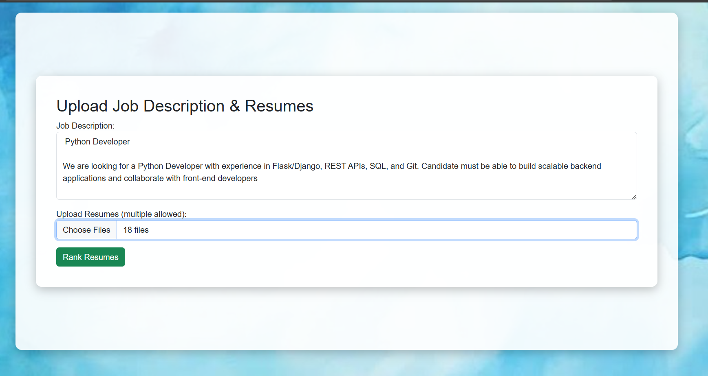
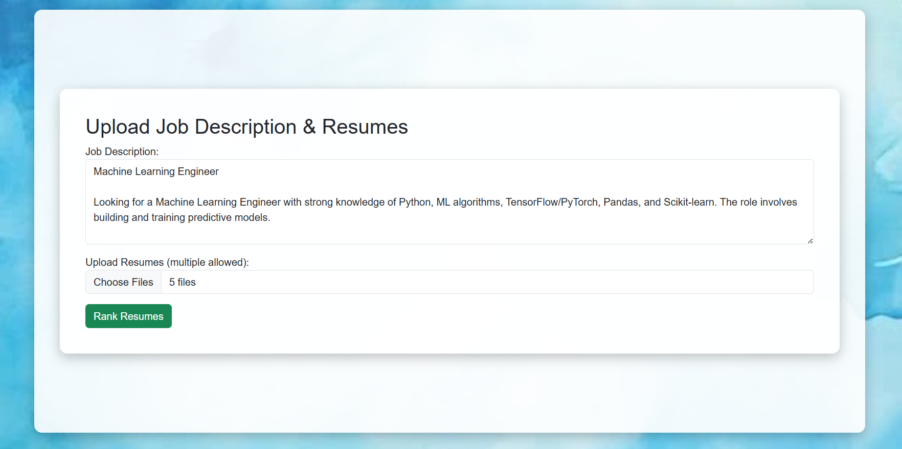
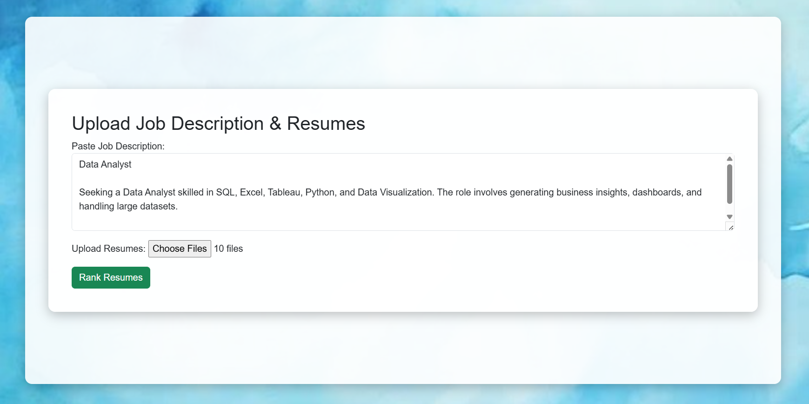
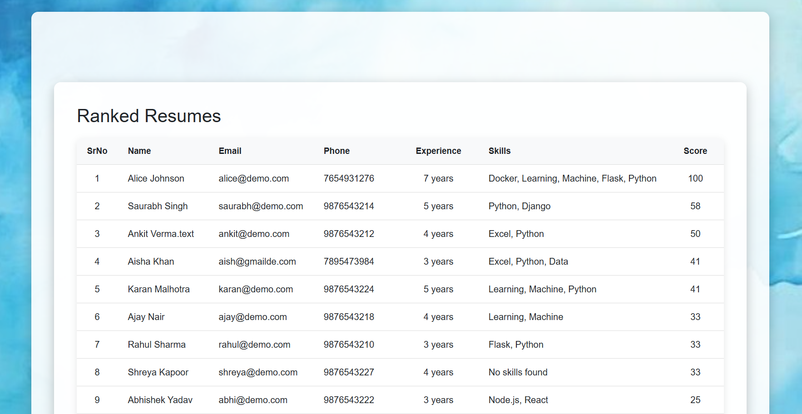

# Resume Ranking System

A web-based application developed using Python, Flask, HTML, CSS, and SQLite that ranks resumes based on skill matching with a given job description.

## Project Overview

The Resume Ranking System helps recruiters and hiring teams compare multiple resumes against job requirements. Users can upload a job description and multiple resumes, and the system generates a ranked list of candidates based on matching skills.

This project was developed as an academic learning project to understand web development, database integration, resume processing, and candidate ranking concepts.

## Features

- User Login System
- Upload Job Description
- Upload Multiple Resumes
- Resume Ranking Based on Skill Matching
- Candidate Score Calculation
- Results Dashboard
- Logout Functionality

## Technologies Used

- Python
- Flask
- HTML
- CSS
- SQLite

## Project Workflow

1. User Login
2. Upload Job Description
3. Upload Resumes
4. Skill Matching
5. Candidate Ranking
6. Display Ranked Results
   
## How to Run

1. Clone the repository
2. Install requirements

pip install -r requirements.txt

3. Run the application

python app.py

4. Open browser and visit:

http://127.0.0.1:5000

## Screenshots

### Login Page

### Welcome Dashboard

### Upload Resume Page

### Python Developer Ranking

### Machine Learning Ranking

### Data Analyst Ranking

### Ranked Results

## Future Enhancements

- PDF Resume Parsing
- AI-Based Resume Analysis
- Export Results to Excel
- Admin Dashboard
- Email Notifications

## Author

Ankita Sarpate
